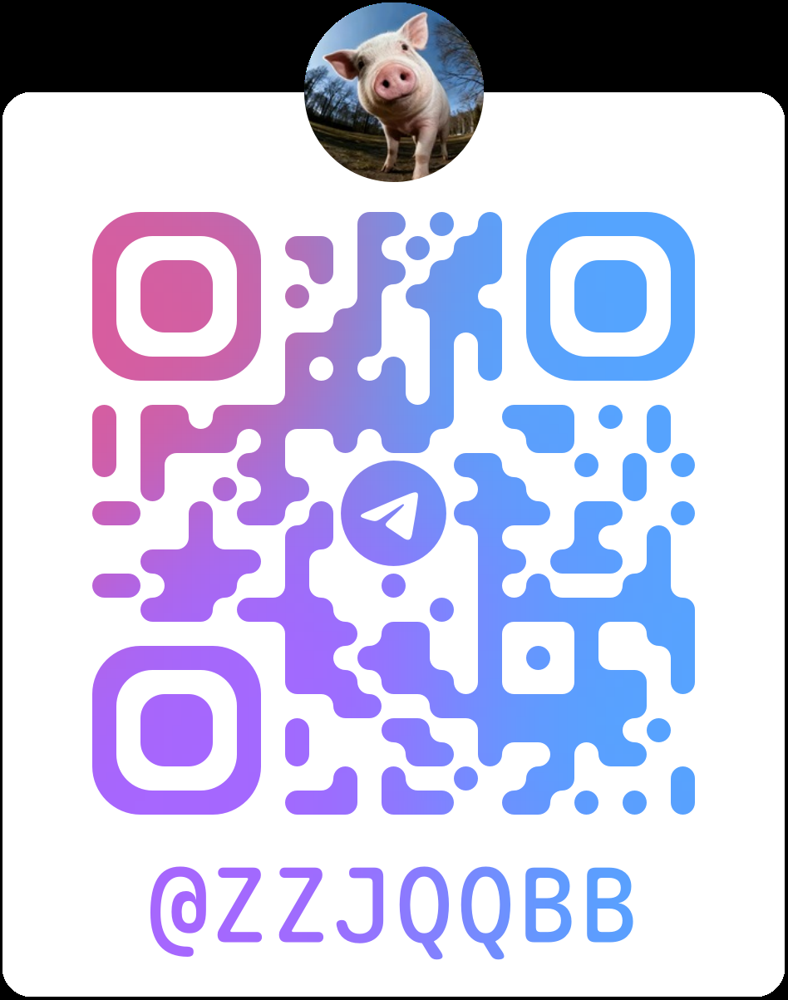

  <h1>Hi there, I'm zzjq 👋</h1>

  <!-- Typing SVG Animation -->
  

  

    
    
    
    
  

---

### 💫 About Me (关于我)

- 🔭 **Current Focus**: 专注于高性能后端架构、微服务系统、分布式数据处理与 **AI Agent / 智能体工作流**的探索与落地。
- 💻 **Tech Stack**: 熟悉 **Go / Java / PHP** 业务及底层系统开发，积极拥抱 Python 与前沿大模型生态。
- 🛠 **Architecture & Ops**: 深入实践 **Docker / Kubernetes** 容器化、**gRPC** 高性能调用、**MySQL / Redis** 存储调优与海量数据集成（SeaTunnel / ETL）。
- 🌱 **Learning & Growth**: 持续跟踪 AI Agentic Design Pattern、云原生技术演进与开源项目架构设计。
- 🎯 **Philosophy**: *“Keep coding, stay curious, and build things that matter.”* (代码即创作，专注打磨高价值系统)
- 📫 **How to reach me**: 欢迎技术探讨与交流，可通过 Telegram [@zzjqqbb](https://t.me/zzjqqbb)、Discord `zzjq_` 或邮箱 [`294014723@qq.com`](mailto:294014723@qq.com) 联系我。

---

### 🤝 Connect with Me (联系方式)

  
  &nbsp;
  
  &nbsp;
  
  &nbsp;
  
  &nbsp;
  

  
<b>📱 Scan Telegram QR Code (点击展开 Telegram 二维码)</b>

   
  

    
  

